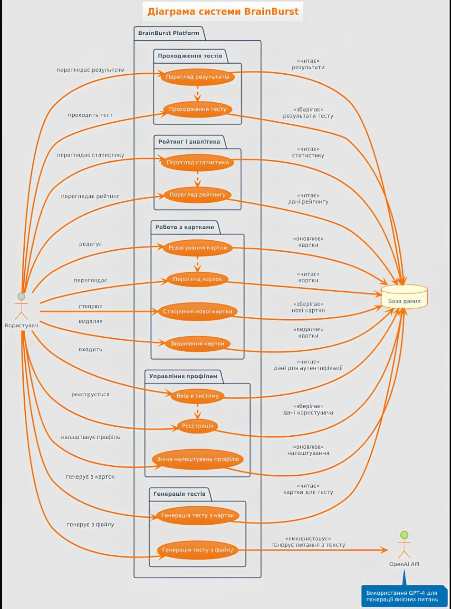

# BrainBurst — Платформа для навчання та самоперевірки

**BrainBurst** — це інтерактивний додаток для вивчення матеріалів за допомогою карток та тестів. Проект поєднує методику інтервальних повторень із сучасними технологіями штучного інтелекту для автоматизації навчання.

---

## 1. Опис проекту
Додаток дозволяє користувачам створювати власні навчальні картки (питання/відповідь), проходити тестування та змагатися з іншими учасниками завдяки системі рейтингів. Головна інновація — використання **OpenAI API** для генерації повноцінних тестів із будь-якого завантаженого тексту.

## 2. Ролі системи
У системі виділено дві ключові ролі:

| Роль | Опис |
| :--- | :--- |
| **Користувач** | Авторизований учасник, який керує своїми картками, проходить тести та отримує бали. |
| **OpenAI API** | Зовнішня інтелектуальна система, що обробляє файли користувача для створення контенту. |

## 3. Виділені підсистеми
Проект логічно розділений на наступні блоки:
* **Управління профілем**: вхід, реєстрація та налаштування персональних даних.
* **Робота з картками**: інтерфейс для ручного створення, редагування та видалення навчальних карток.
* **Генерація тестів**: модуль взаємодії з ШІ для створення тестів з текстових файлів.
* **Проходження тестів**: ігровий модуль, де користувач відповідає на питання та отримує бали.
* **Рейтинг і аналітика**: система збору статистики та формування таблиці лідерів за балами та рангами.

## 4. Специфікація Use-Cases (Таблиця)
Нижче наведено опис основних функцій системи для кожної ролі:

| Підсистема | Use-Case | Опис |
| :--- | :--- | :--- |
| **Профіль** | Вхід у систему | Перевірка облікових даних користувача для доступу до бази. |
| **Картки** | Створення картки | Користувач додає пару "питання-відповідь" до своєї колекції. |
| **Генерація** | Генерація з файлу | Система відправляє текст у OpenAI API та зберігає результат у форматі карток. |
| **Тести** | Проходження тесту | Користувач відповідає на питання; система нараховує +10 балів за правильну відповідь. |
| **Рейтинг** | Перегляд статистики | Відображення поточного рангу (Початківець, Любитель, Професіонал). |

## 5. Use-Case Діаграма (UML)
Діаграма відображає взаємодію користувача з функціональними блоками системи:

---

## 6. Валідація та системні вимоги
* **ОС**: Windows 10/11.
* **Безпека**: Паролі зберігаються у зашифрованому вигляді, передача даних — через HTTPS.
* **Валідація**: Кожна вимога перевіряється через успішне виконання відповідного Use-Case (наприклад, перевірка збереження балів у БД після тесту).

## 7. Валідація та повнота системи
- **Коректність ролей**: Ролі "Користувач" та "OpenAI API" чітко розділені на ініціатора дій та сервіс-провайдера.
- **Повнота Use-Cases**: Описані всі критичні цикли: від реєстрації та створення контенту до гейміфікованого тестування та перегляду результатів у глобальному рейтингу.
- **Відповідність**: Кожен Use-Case у таблиці відповідає вузлу на UML-діаграмі та функціональним вимогам у специфікації.
